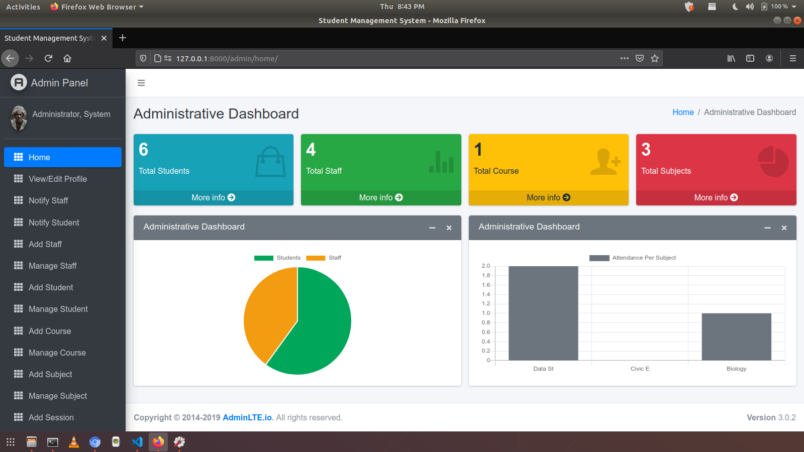
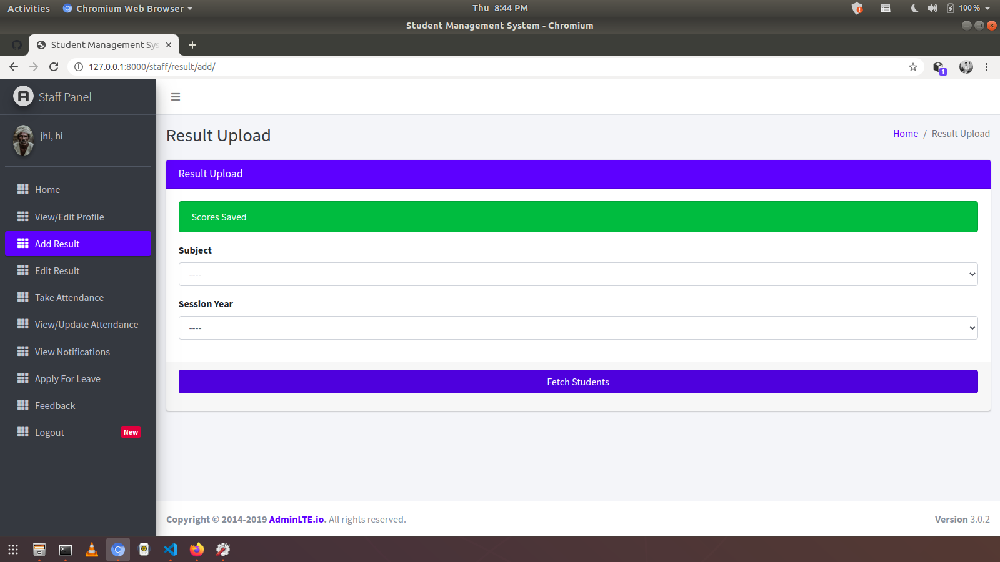
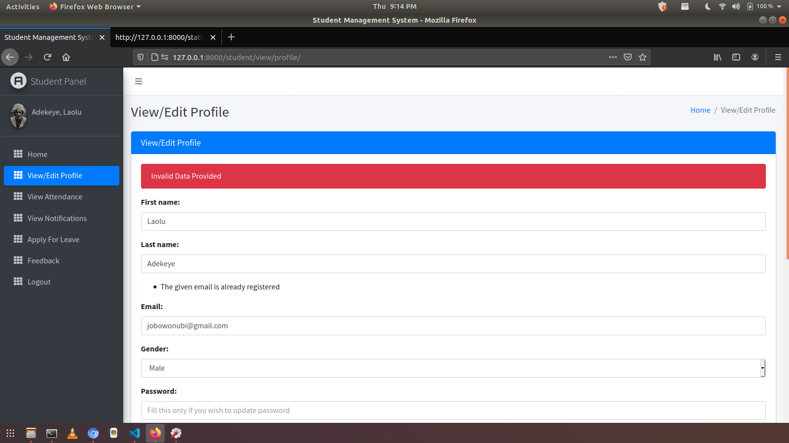
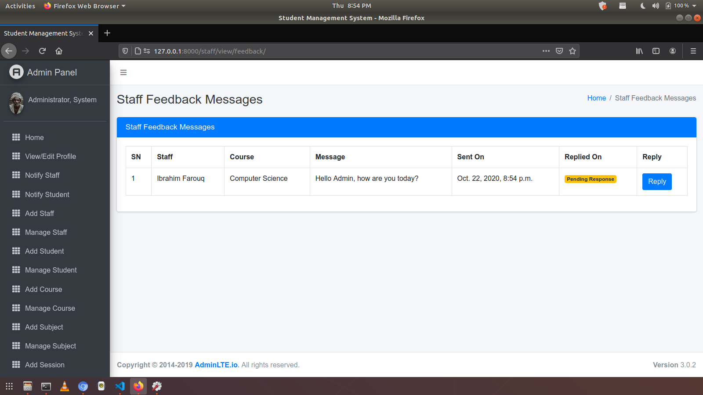

# Student Management System  Using Django
This is a Simple Student Management System Developed While Learning Django.
Feel free to make changes based on your requirements.

## 📸 ScreenShots







| Admin| Staff| Student |
|------|-------|---------|
||||
||||
||||
||||
||||
||||


### Installation
**1. Create a Folder where you want to save the project**

**2. Create a Virtual Environment and Activate**

Install Virtual Environment First
```
$  pip install virtualenv
```

Create Virtual Environment

For Windows
```
$  python -m venv venv
```
For Mac
```
$  python3 -m venv venv
```
For Linux
```
$  virtualenv .
```

Activate Virtual Environment

For Windows
```
$  source venv/scripts/activate
```

For Mac
```
$  source venv/bin/activate
```

For Linux
```
$  source bin/activate
```

**3. Clone this project**
```
$  git clone https://github.com/MKumardmk/Student-Management-System.git
```

Then, Enter the project
```
$  cd STtudent-Management-System
```

**4. Install Requirements from 'requirements.txt'**
```python
$  pip install -r requirements.txt
```


**5. Now Run Server**

Command for PC:
```python
$ python manage.py runserver
```

Command for Mac:
```python
$ python3 manage.py runserver
```

Command for Linux:
```python
$ python3 manage.py runserver
```

**7. Login Credentials**

Create Super User (HOD)
Command for PC:
```
$  python manage.py createsuperuser

